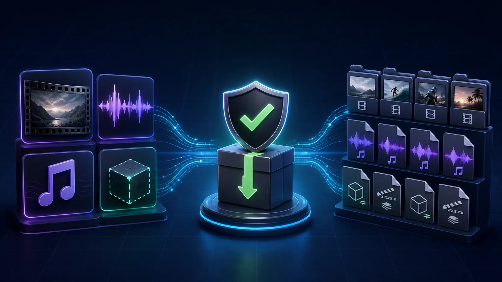
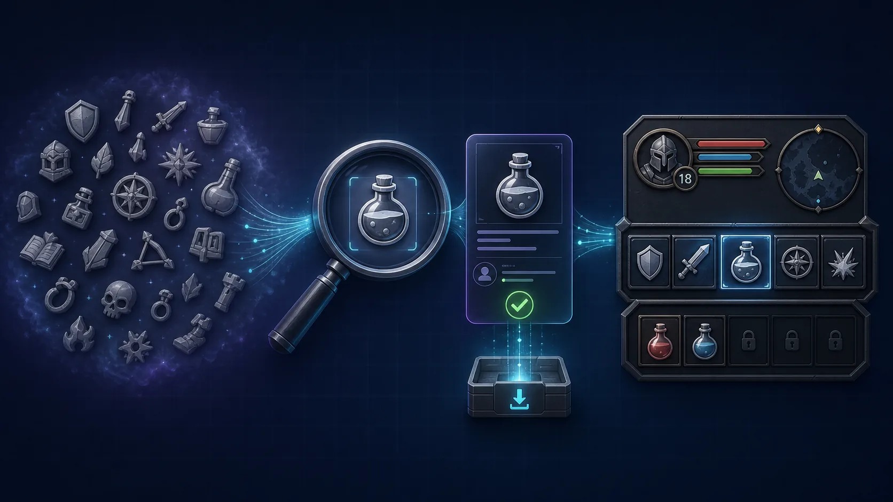
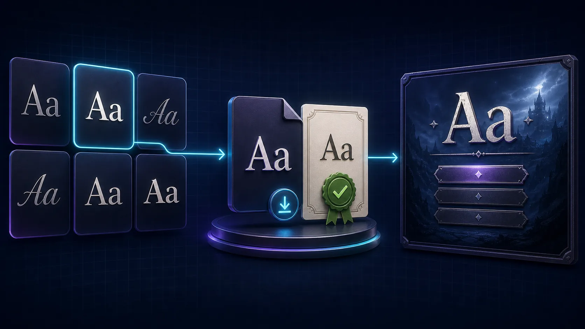
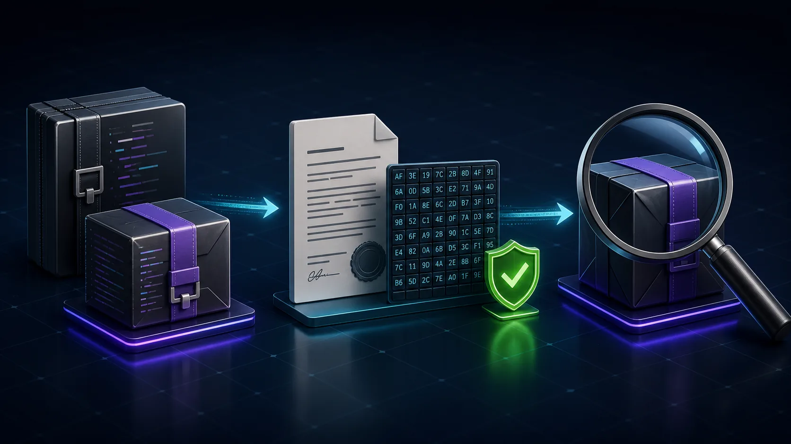

# DCC-MCP Free Media Assets

DCC-neutral skills for finding and downloading license-safe media used by content and game demos.

- `pexels-video-assets` searches the official Pexels API and downloads selected video files.
- `mixkit-free-assets` downloads selected Mixkit music, sound effects, and explicit AE template ZIPs.
- `github-release-plugins` inspects licensed open-source GitHub projects and downloads release assets with SHA-256 verification metadata.
- `game-icons-assets` searches and downloads CC BY 3.0 SVG icons from Game-Icons.net.
- `google-font-assets` searches Google Fonts and downloads one verified font variant with its family license; keyless mode provides the pinned Noto Sans SC Regular fallback.

Every download returns a validated `AssetDescriptor` with a local file, original source URL,
creator when available, and license information. The skills never import files into Adobe apps;
pass the descriptor to an adapter skill for that step.

Pexels requires `PEXELS_API_KEY`. Google Fonts search and general downloads require `GOOGLE_FONTS_API_KEY`;
without one, `google-font-assets` v0.2.0 accepts only exact `Noto Sans SC` / `regular` and verifies the font and OFL license against an immutable official noto-cjk revision.
Mixkit downloads are resolved from current listing/item pages.
GitHub plugin downloads require a public repository with a declared open-source SPDX license.
This repository does not redistribute third-party media, templates, or plugin binaries.

## Showcases

### Pexels video assets


### Mixkit free assets



### Game icons assets



### Google font assets



### GitHub release plugins



These are original workflow illustrations; no third-party thumbnails, logos, or interface captures
are reproduced.

## Validate

```bash
python tests/smoke_test.py
```
